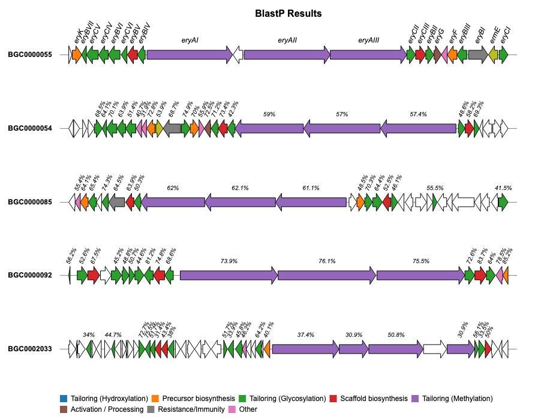
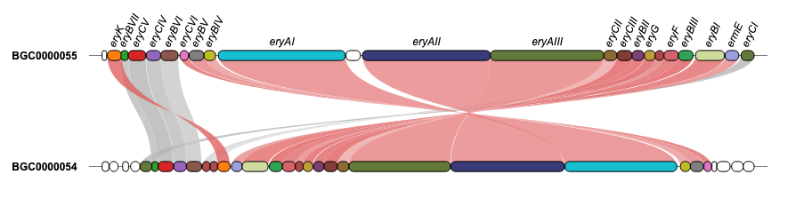

<p align="center">


<h1><strong>geneviewer</strong> - Gene Cluster Visualizations in R</h1>

</p>

<!-- badges: start -->

[](https://github.com/nvelden/geneviewer/actions) [](https://CRAN.R-project.org/package=geneviewer) 

<!-- badges: end -->

## geneviewer

**geneviewer** is an R package designed for visualizing gene clusters. It can import data directly from GenBank files, perform BlastP alignments between clusters and visualize the results in gene arrow maps. In addition there are extensive options to customize the gene arrow maps such as adding a legend, labels, links, annotations, customized scales, colors, tooltips and much more. To explore all features visit the [package website](https://nvelden.github.io/geneviewer/articles/geneviewer.html).

## Installation

**geneviewer** is still in the development stage which might lead to breaking changes and thus not yet released on CRAN. You can install the development version from [GitHub](https://github.com/) with:

``` r
# install.packages("devtools")
devtools::install_github("nvelden/geneviewer")
```

## Usage

The below example demonstrates using **geneviewer** to plot a gene cluster on a genomic sequence, using the start and end positions of each gene. The genes are grouped by class and labels are added using the `GC_labels` function.

``` r
library(geneviewer)

# Data
gene_cluster <- data.frame(
  name = c("ophB1", "ophC", "ophA", "ophD", "ophB2", "ophP", "ophE"),
  start = c(2522, 5286, 9536, 12616, 13183, 19346, 20170),
  end = c(4276, 4718, 10904, 11859, 15046, 16016, 21484),
  class = c("Monooxygenase", "NTF2-like", "Methyltransferase", 
  "O-acyltransferase", "Monooxygenase", "Prolyloligopeptidase", 
  "F-box/RNHI-like")
)

# Chart
GC_chart(gene_cluster, group = "class", height = "100px") %>%
  GC_labels("name")
```


## Examples

For additional examples and the corresponding code to create the plots, please visit the [Examples](https://nvelden.github.io/geneviewer/articles/Examples.html) section.



<hr>



<hr>


<hr>


<hr>


## Issues

If you encounter any issues or have feature requests, please open an [Issue](https://github.com/nvelden/geneviewer/issues).
