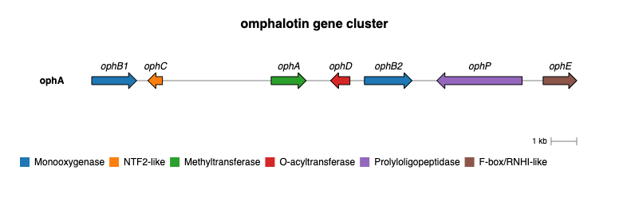

<p align="center">
  
  <h1><strong>GCVieweR</strong> - Interactive Gene Cluster Visualizations in R</h1>
</p>

<!-- badges: start -->
[](https://github.com/nvelden/GCVieweR/actions)
[](https://CRAN.R-project.org/package=GCVieweR)

<!-- badges: end -->

## GCVieweR

**GCVieweR** is an R package designed for gene cluster visualizations. It allows side by side visualization of multiple clusters and has options to add a legend, labels, annotations, and interactive tooltips.

## Installation

You can install the development version of **GCVieweR** from [GitHub](https://github.com/) with:

``` r
# install.packages("devtools")
devtools::install_github("nvelden/GCVieweR")
```

## Example

The below example demonstrates using **GCVieweR** to plot a gene cluster on a genomic sequence, using the start and stop positions of each gene. The genes are grouped by class. Additional functions are used to include a title, labels, legend, and a scale bar.

``` r
library(GCVieweR)

# Data
gene_cluster <- data.frame(
  name = c("ophB1", "ophC", "ophA", "ophD", "ophB2", "ophP", "ophE"),
  start = c(2522, 5286, 9536, 12616, 13183, 19346, 20170),
  stop = c(4276, 4718, 10904, 11859, 15046, 16016, 21484),
  class = c("Monooxygenase", "NTF2-like", "Methyltransferase", 
  "O-acyltransferase", "Monooxygenase", "Prolyloligopeptidase", 
  "F-box/RNHI-like")
)

# Chart
GC_chart(gene_cluster, group = "class", height = "200px") %>%
  GC_title("omphalotin gene cluster") %>%
  GC_labels("name") %>%
  GC_legend(position = "bottom") %>%
  GC_scaleBar() %>% 
  GC_clusterLabel(title = "ophA")
```


